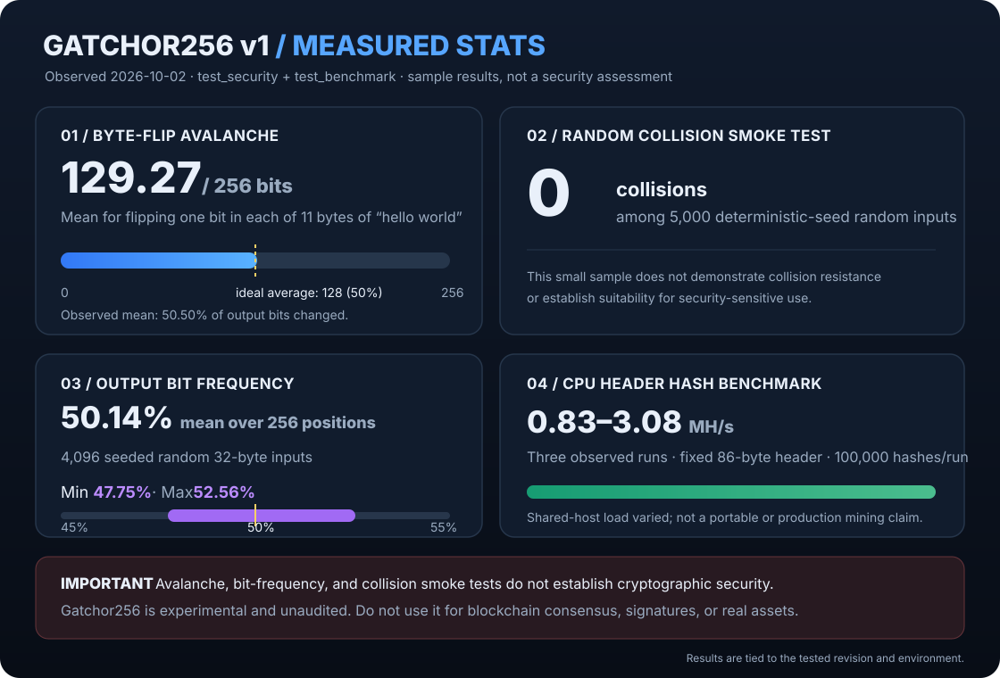

# Gatchor256 Documentation

## Overview
**Gatchor256** is an experimental, non-cryptographic hashing library that provides
a simple and efficient interface for data-integrity experiments and benchmarks.

> ⚠️ **Security warning:** Gatchor256 has not received independent cryptanalysis
> or a security audit. Do not use it for authentication, signatures, password
> hashing, commitments, Merkle trees, address derivation, or blockchain
> consensus/Proof-of-Work. Use a standardized, vetted primitive such as
> SHA-256, SHA-3, BLAKE2, or BLAKE3 for security-sensitive applications.

---

## Features
- Fast and efficient hashing
- Simple and CPU-friendly
- Suitable for experiments and benchmarking only
- Open to community contributions

---

## Installation

```
# Clone the repository
git clone https://github.com/synnaulaid/Gatchor.git
cd Gatchor
# Build the library
mkdir -p build && cd build
cmake ..
make -j$(nproc)
```
**Binary**
```
main - sample imput
interactive - interactive mode input
test_gatchor - tests for gatchor256
test_pow - proof-of-work/header validation tests
test_transaction - canonical transaction and Ed25519 signature tests
test_chain - local chain storage/fork choice tests
test_nodes - in-process two-node simulation
test_network - TCP loopback propagation test (POSIX)
test_security - tests for security of gatchor256
test_benchmark - benchmark tests for gatchor256
```

## CPU mining integration

For a mining loop, keep the block header in a reusable byte buffer and update
only the nonce. Use `Gatchor256::hash_into(std::span<const uint8_t>, Digest&)`
to write the 32-byte digest directly. This avoids the input-sized padding
allocation and hexadecimal formatting on every attempt, keeping memory usage
constant and reducing per-hash overhead. The benchmark uses the fixed-width
header/nonce path. The existing `hash(vector)` API remains available
for applications that need a hexadecimal string.

The default build is portable and does not enable CPU-specific instructions.
For local benchmarking only, `-march=native` can be enabled explicitly:

```
cmake -S . -B build -DGATCHOR_NATIVE_OPTIMIZATIONS=ON
cmake --build build -j$(nproc)
```

Building requires OpenSSL 1.1.1 or newer development files (`libssl-dev` on
Debian/Ubuntu).

Do not use the native optimization option for binaries distributed to other
machines.

## Experimental proof-of-work header

The `gatchor_pow.hpp` API provides an experimental fixed-width header and
bounded CPU miner/verifier. The 86-byte header is serialized as version
(uint32 little-endian), previous hash (32 bytes), Merkle root (32 bytes),
timestamp (uint64 little-endian), difficulty (uint16 little-endian
leading-zero-bit count), and nonce (uint64 little-endian). The digest is
interpreted in byte order as returned by `hash_into`; a valid digest must have
at least the requested number of leading zero bits.

`mine_header` tries up to the caller-specified number of nonces. These APIs
also provide minimal genesis/child header validation: protocol version 3,
difficulty in [1, 256] (fixed across parent and child), strictly increasing
timestamps, a two-hour future-time allowance, parent linkage, and proof of
work. `PowBlock` adds a transaction list and a domain-separated binary Merkle
root (leaf prefix `0x00`, parent prefix `0x01`, duplicate the final node at an
odd-width level); non-genesis block validation rejects empty transaction
lists, root mismatches, and transactions that fail the canonical
signed-transaction checks. Genesis blocks are empty and commit to the
configured allocation list instead.

`ChainStore` provides a local chain snapshot file with atomic replacement,
reload validation, and rejection of corrupted data. `consider_chain` validates
candidate branches with the same genesis, then selects by cumulative expected
work (`2^difficulty` per block); equal-work branches use the lexicographically
smaller tip digest as a deterministic tie-break. A selected branch replaces
the local snapshot. `TwoNodeSimulationTest` exercises block propagation,
fork convergence, invalid-block rejection, and restart between two independent
local stores; it is an in-process simulation, not socket-based networking.
On POSIX systems, `LoopbackBlockServer` and `send_block_loopback` provide a
single-message TCP prototype bound strictly to `127.0.0.1`, with bounded frame
sizes and block validation before append. It is only intended for local
experiments; it has no peer discovery, authentication, encryption, retries,
or public-network support. Protocol v3 uses signed transaction v2, a fixed
157-byte little-endian encoding containing chain ID 1, account nonce, amount,
fee, sender Ed25519 public key, recipient key, and an Ed25519 signature over a
domain-separated canonical message. Chain configuration supplies a sorted,
fixed genesis allocation list, whose commitment is stored in the genesis
Merkle-root field.
Nodes replay the ledger deterministically: account nonces begin at zero,
transactions debit `amount + fee`, recipients receive `amount`, and fees are
burned (there is no miner reward). Invalid signatures, wrong chain IDs, nonce
gaps/replays, overspending, and arithmetic overflow are rejected. Existing
protocol-v1/v2 snapshots are intentionally incompatible and must not be
reused. Difficulty adjustment is not implemented. This is an experimental
testnet scaffold, not production blockchain consensus. The snapshot is not a
crash-durable or untrusted-input hardened database.

# Gatchor256 v1 statistics



The chart is regenerated from the current `test_security` and `test_benchmark`
executables. It summarizes one run: avalanche response, a 5,000-input random
collision smoke test, per-bit output frequencies over 4,096 inputs, and an
86-byte header hashing benchmark. Results are measurements, not cryptographic
assurances; benchmark throughput varies with CPU and system load.


Full Documentation can be found in [docs/docs.md](docs/docs.md).