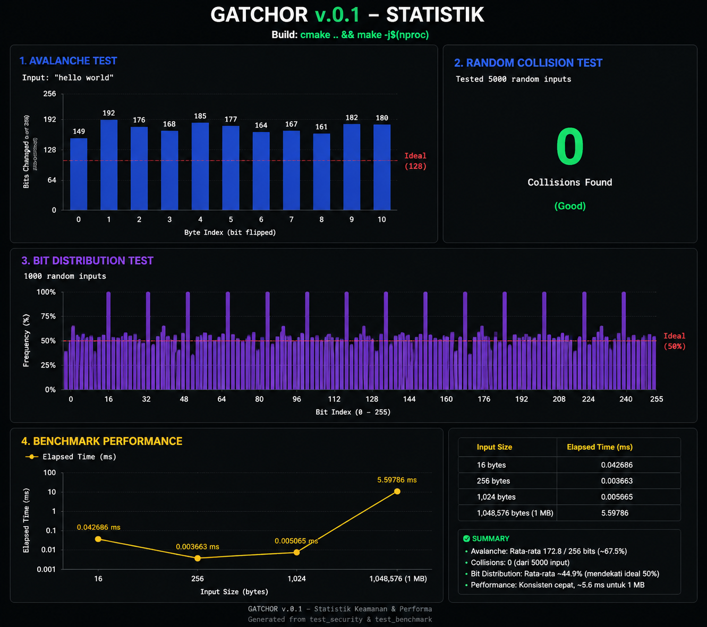

# Gatchor256 Documentation

## Overview
**Gatchor256** is a hashing library that provides a simple and efficient interface for hashing data using the **Gatchor256 algorithm**.
This library is designed to be **fast, reliable, and suitable for a wide range of applications**, ranging from data integrity checks to cryptographic operations.

> ⚠️ **Note:** Gatchor256 is currently under active development. Contributions and feedback are highly appreciated!

---

## Features
- Fast and efficient hashing
- Simple and CPU-friendly
- Suitable for both small and large datasets
- Open to community contributions

---

## Installation

```
# Clone the repository
git clone https://github.com/synnaulaid/Gatchor.git
cd Gatchor
# Build the library
mkdir -p build && cd build
cmake ..
make -j$(nproc)
```
**Binary**
```
main - sample imput
interactive - interactive mode input
test_gatchor - tests for gatchor256
test_security - tests for security of gatchor256
test_benchmark - benchmark tests for gatchor256
```

## CPU mining integration

For a mining loop, keep the block header in a reusable byte buffer and update
only the nonce. Use `Gatchor256::hash_into(std::span<const uint8_t>, Digest&)`
to write the 32-byte digest directly. This avoids the input-sized padding
allocation and hexadecimal formatting on every attempt, keeping memory usage
constant and reducing per-hash overhead. The benchmark uses this exact
80-byte header/nonce path. The existing `hash(vector)` API remains available
for applications that need a hexadecimal string.

The default build enables `-march=native` for maximum throughput on the local
CPU:

```
cmake -S . -B build -DGATCHOR_NATIVE_OPTIMIZATIONS=ON
cmake --build build -j$(nproc)
```

For a portable binary, disable CPU-specific instructions:

```
cmake -S . -B build -DGATCHOR_NATIVE_OPTIMIZATIONS=OFF
```

# Statistics



Full Documentation can be found in [docs/docs.md](docs/docs.md).